## Lab1 Environment Variable and SetUID

| 实验名称 | Environment Variable and SetUID |
| -------- | ------------------------------- |
| 姓名     | 宗威旭                          |
| 学号     | 3180102776                      |
| 学院     | 计算机科学与技术                |
| 小组     | 王晨皓、谢华洋、宗威旭          |

### 一、实验总述

实验主要介绍了SetUID程序的原理、作用，并从环境变量、system()调用、内存泄漏多个方面介绍其存在的安全性问题。实验以UNIX系统为实验对象，实验内容主要包括环境变量的设置和修改、SetUID程序的创建、通过修改环境变量利用SetUID程序的root权限、通过system()调用利用SetUID程序的root权限和通过内存泄漏利用SetUID程序的root权限。

### 二、实验过程

#### Task 1：Manipulating Environment Variables

task1主要测试系统查看、设置环境变量的正确性。测试命令如下：

```bash
env | grep PWD
export -p | grep PWD
export PWD="/usr/bin"
env | grep PWD
unset PWD
env | grep PWD
```

首先查看`PWD`变量（当前目录/home/seed），通过`env`或`export -p`均可实现。而后通过`export`和`unset`修改/删除PWD的值，观察实验结果如下。可以看到PWD值对应的变化。

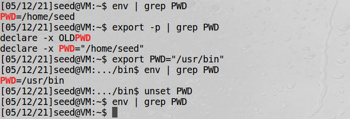

值得注意的点是，env和export命令都可用于环境变量的修改和查看。env是系统调用，而export是`builtin command`。export设置环境变量和直接赋值有所区别。例如下面的例子中，通过`grep`的`GREP_OPTIONS`观察可以看到，直接赋值并不能将变量赋值传递给后续command，通过export则可以改变（powershell内的）环境变量。

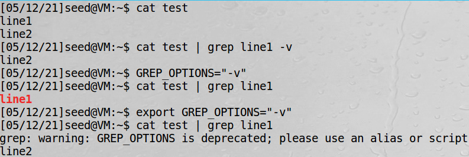

#### Task 2：Passing Environment Variables from Parent Process to Child Process

task2通过fork创建一个子进程，并比较父进程和子进程的环境变量。通过fork()命令创建子进程中的环境变量继承其父进程，因此两者的环境变量理应相同。便于区分，我在父进程和子进程的输出前分别加了标识（这里的pid并无参考意义），结果如下。可以看到两者的环境变量完全相同。

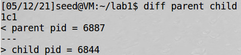

#### Task 3: Environment Variables and execve()

task3通过execve()在进程间传递环境变量。task2中fork()创建子进程的环境变量继承于父进程，而环境变量在进程中的传递还有更灵活的方式。`execve()`在创建新的进程（替换原有进程）的同时，可以通过参数`envp[]`指定传递环境变量。我们通过执行`/usr/bin/env`来观测新进程的环境变量，第一次传递NULL，第二次则传递environ。可以看到两次传递结果如下（截图节选部分）：

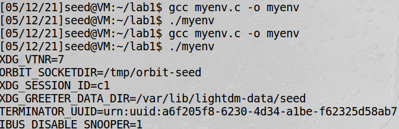

#### Task 4: Environment Variables and system()

task4观察system()的原理，进而理解通过SetUID program来造成安全威胁的影响。system(cmd)并不直接执行cmd，而是首先执行`/bin/sh -c cmd`进而通过`/bin/sh`执行相关命令。调用后环境变量传递给`/bin/sh`。验证结果如下：

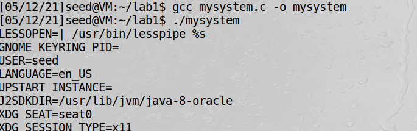

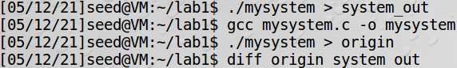

#### Task 5: Environment Variable and Set-UID Programs

task5观察在shell中执行SetUID程序过程中，环境变量的传递情况，从而进一步理解哪些环境变量会对安全性构成威胁。这一步有一个另外意外的点，也就是并非所有的环境变量都会传递到子程序，部分环境变量在某一执行条件下是对安全性没有威胁的。例如在下面我们会看到的`LD_LIBRARY_PATH`。

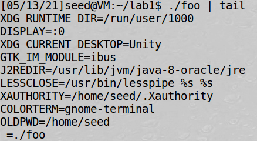

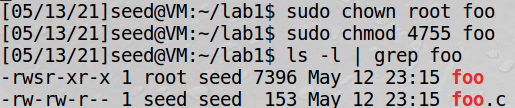

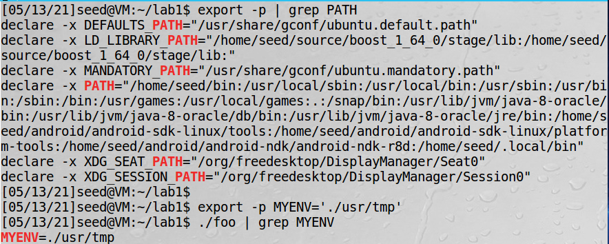

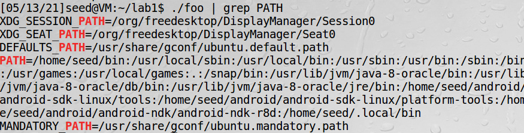

可以观察到，在将foo文件变成SetUid文件之后，我设置的环境变量`MYENV`出现在子进程（foo的执行进程）中。值得注意的是，无论我是否手动修改LD_LIBRARY_PATH环境变量，我并没有在foo文件的输出中找到`LD_LIBRARY_PATH` 。可见该环境变量并不会在此造成安全性影响。关于这一点的详细原因也可以在task7中看到。

#### Task 6: The PATH Environment Variable and Set-UID Programs

task6实践了一个通过修改环境变量来利用SetUID程序的root权限的例子。从task5可以看到，`PATH`变量被传递到执行SetUID程序的子进程。如果我们在system调用中使用相对路径，并修改PATH环境变量，那么就可以通过root权限执行我们目录中的对应程序（命令）。

```c++
// myls.c
#include <stdio.h>

int main() {
    system("ls");
    return 0;
}
```

```bash
sudo chown root myls
sudo chmod 4755 myls
```

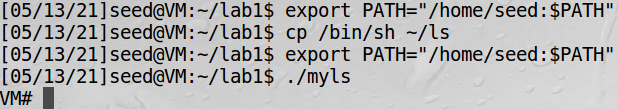

编译并将myls文件设置为SetUID程序。myls.c中系统调用ls，本应该为/bin/ls。这里，我们修改环境变量`PATH`为自己的目录，并将`/bin/sh`作为我们目录中的ls文件。然后，执行之后我们则发现：ls执行的是我们目录中的ls，即实际的/bin/sh。作为SetUID程序，其执行权限为root。

#### Task 7: The LD PRELOAD Environment Variable and Set-UID Programs

task7观察编译过程中环境变量在SetUID程序中的安全性影响。主要观测变量为`LD_PRELOAD`，该环境变量由用户指定，优先load用户指定的库，如果部分函数在指定库中找不到，则会查找其他目录，如`LD_LIBRARY_PATH`中的库。因此，我们可以通过修改这两个环境变量，并观察其在SetUID程序中的状况。

首先，编译我们自己的库和测试文件，并将我们自己创建的share library添加到`LD_PRELOAD`环境变量。

```bash
gcc -fPIC -g -c mylib.c
gcc -shared -o libmylib.so.1.0.1 mylib.o -lc
gcc myprog.c -o myprog
```

执行普通程序，执行我们自定义库中sleep：

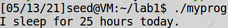

将程序修改为SetUID程序，执行标准库中sleep：

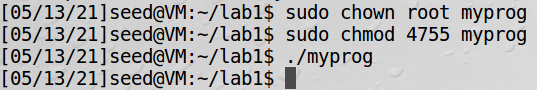

将程序修改为SetUID程序后，并将环境变量`LD_PRELOAD`添加到root账户，执行我们自定义库中sleep：

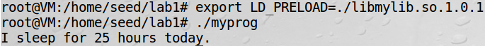

将程序的owner设为其他非root用户，并将环境变量`LD_PRELOAD`添加到该账户，执行我们自定义库中sleep：

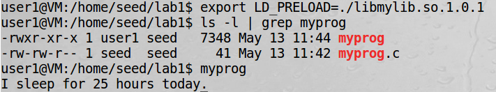

可以看到，执行我们自定义库中函数需要满足的条件为：设置LD_PRELOAD环境变量，并且使执行者作为当前执行文件的owner。这里与动态连接器使用的countermeasure有关。如果EUID和RUID不同，则LD_PRELOAD环境变量被忽略。在step2中，root为文件的owner，而EUID仍为seed，所以LD_PRELOAD环境变量并未在子进程被创建。我们可以尝试在条件下程序中输出环境变量，并尝试找到LD_PRELOAD。

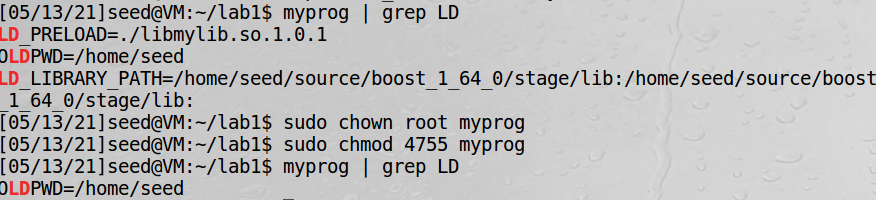

如图，修改myprog程序，使其输出环境变量。重新执行step2的前两个条件，发现在第二个条件下，LD_PRELOAD和LD_LIBRARY_PATH都并没有被实际传递到子进程。

#### Task 8: Invoking External Programs Using system() versus execve()

task8显示，system调用对于安全性的影响不仅仅在于环境变量，还在于其可能通过调用外部程序（具有root权限）。如果用户提供的输入巧妙的不符合规范，则很有可能被识别为一条命令。例如样例代码中，如果我们提供恰当的输入，则可以利用root权限启动bash，从而可以获得修改（写）其他文件的权限。

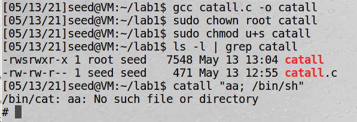

如上，bob输入的内容，system调用的实际内容为`cat aa; /bin/sh`，从而可以通过root权限启动/bin/sh，这显然是不安全的。如果使用execve则并无这一问题（后面输入并不会被识别做命令）。

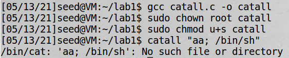

#### Task 9: Capability Leaking

task9讨论了内存泄漏在SetUID程序中的安全性问题。如果我们在通过调用`setuid(n)`来回收root权限之前，没有充分回收部分空间，则有可能导致部分本应该具有普通用户权限的功能具有root权限。例如下面的例子中，我们在调用setuid之前，并没有关闭fd（子进程的fd来自其父进程），在/bin/sh中，fd依然是可用的，且其仍具有root权限。因此，我们可以对原来本需root权限方能修改的文件进行修改。

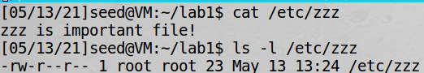

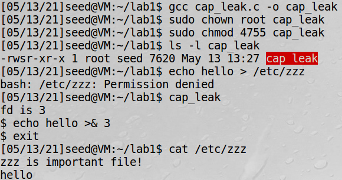

为了避免这种情况，我们需要提前关闭文件描述符，既close(fd)之后再调用setuid，从而避免内存泄漏。

### 三、实验心得

SetUID程序本身设计目的在于，将程序所需要的root权限具体化。但取得root权限的本身就意味着不得不面对安全性的挑战，事实上，我们实验中针对漏洞的攻击方式，无论是利用环境变量或是内存泄漏，都是在这些具体的功能中劫持root权限。曾经在操作系统实现过自己的shell，其中也包括shell中的环境变量，这一设计本身为使用者提供了更灵活的操作空间，但对关键环境变量的保护，实际上从安全角度考虑，是非常有必要的。值得庆幸的是，针对system()和内存泄漏，是我们可以尽量去避免的安全问题，这也给我以后程序编写过程中的安全考虑给予提示。