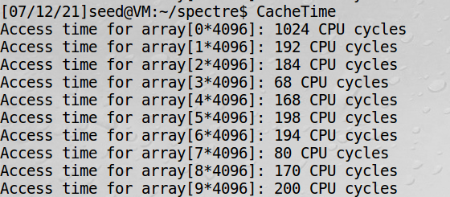
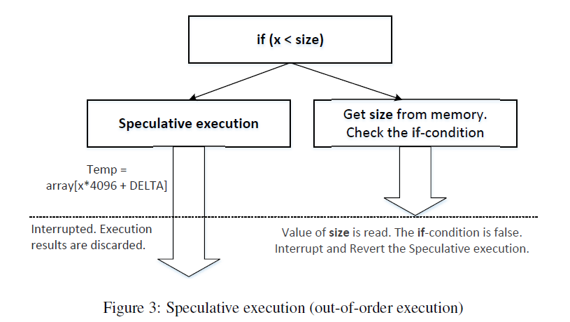
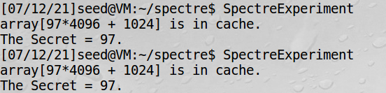
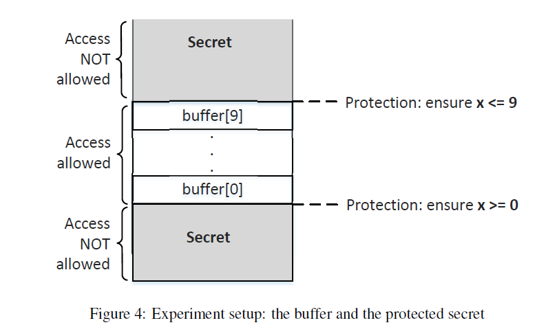
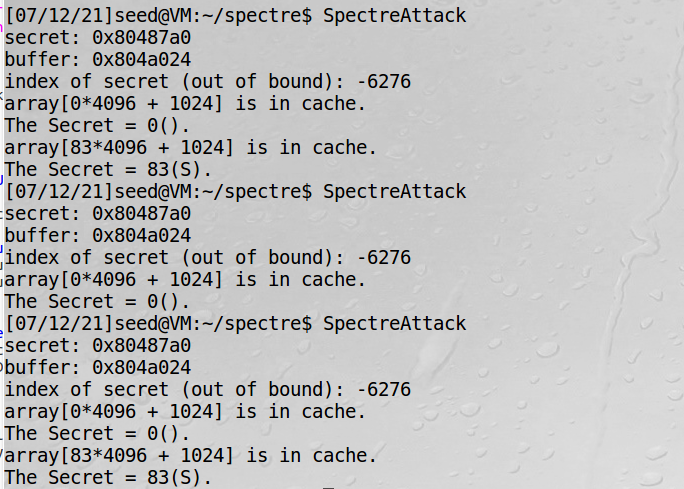
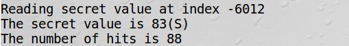
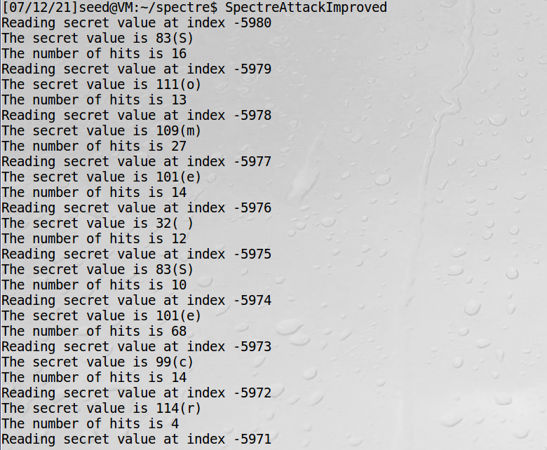

## Spectre Attack

### 一、实验总述

Spectre Attack （幽灵攻击）破坏了进程间和进程内的隔离。Spectre Attack 通过 cache 作为攻击旁路，利用 CPU out-of-order 的特性，可以成功观测到不具有访问权限部分的数据。幽灵攻击于 2017 年公布，存在于包括 AMD，intel 和 ARM 等诸多当代流行的处理器。

### 二、实验过程

#### Tasks 1 and 2: Side Channel Attacks via CPU Caches

这里和 Meltdown Attack 的原理其实大同小异，都是通过 CPU cache 作为旁路进行攻击。这一步的主要目标是找到一个区分 cache 访问时间和 memory 访问时间的 threshold，以及初步走一遍这个旁路攻击的过程。

这里是一个 `FLUSH+RELOAD` 的过程。清空 cache 是这么做的：

```c++
for (i = 0; i < 256; i++) _mm_clflush(&array[i*4096 +DELTA]);
```

reload 过程是记录了 memory read 前后 TSC 的差值，借此来记录该块内存的访问时间。

```c++
int junk = 0;
for(i = 0; i < 256; i++){
	addr = &array[i*4096 + DELTA];
	time1 = __rdtscp(&junk);
	junk = *addr;
	time2 = __rdtscp(&junk) - time1;
	if (time2 <= CACHE_HIT_THRESHOLD){
		printf("array[%d*4096 + %d] is in cache.\n", i, DELTA);
		printf("The Secret = %d.\n",i);
	}
}
```

从实验结果看到，其实 Cache 的访问速度还是快很多的，设置 `threshold = 100`。



我们可以构造一个 victim function，这个函数使用目标值 (secret value) 作为 index 来访问 array，从而将对应的 block 读取到 CPU cache。为了找到这样一个 block，应该将 victim function 在 flush 和 reload 之间进行。

```c++
void victim() {
  temp = array[secret*4096 + DELTA];
}
```

这样就说明成功找到了，基本这一步还是很容易成功的。


#### Task 3: Out-of-Order Execution and Branch Prediction

这里的原理仍然和 Meltdown Attack 十分相似，同样利用了 CPU 的 out-of-order execution 机制。不同的是，meltdown 攻击利用的是内存访问时的执行机制，而 spectre 利用的则是分支预测机制。这一点其实和我们在体系结构学的分支预测知识有一定关联。即在执行 branch condition 的判断过程中，CPU 被允许进行分支预测，预先执行一部分指令。例如：

```c++
void victim(size_t x) {
  if (x < size) {  
      temp = array[x * 4096 + DELTA];
  }
}
```

代码中，如果预测分支为 true，那么 temp = array[x * 4096 + DELTA] 这条指令会在 condition 的判断结束前执行。盗个图：



这里接下来就和 Meltdown attack 异曲同工。优先执行的乱序指令在 cache 造成的影响不会被擦除，仍然可以在 reload 阶段观测到这一结果，在这里就可以用目标值（secret value）作为 index 访问对应的 cache block。

因此，成功就有几个关键点。第一个是在分支预测时进入 speculative execution。为了让 victim 函数执行时的分支预测为 true，以提前执行代码块内部的代码，需要进行一个分支预测的训练：

```c++
for (i = 0; i < 10; i++) victim(i);
```

第二个是尽可能让 size 的访问长一些，这里清空其在 cache 中对应的 block。

```c++
_mm_clflush(&size);
```

这样就说明上面的策略成功了。这一步成功率还是很高的，毕竟是最优化条件下的测试。



#### Task 4: The Spectre Attack

本实验中，发动 Spectre Attack 的应用场景是进程内的数据访问。在 sandbox 的保护下，理论上只能访问指定区域的数据。如果这种访问权是根据 condition 语句来判断的，那么我们就有机会利用分支预测机制来执行本来没有权限的部分的源码，从而访问正常访问区域之外的数据。



假设为了控制上面的 secret 部分不被访问，sandbox 提供保护的方式如下：

```c++
// Sandbox Function
uint8_t restrictedAccess(size_t x)
{
  if (x <= bound_upper && x >= bound_lower) {
     return buffer[x];
  } else {
     return 0;
  } 
}
```

为了访问到 secret 部分的数据，我们应该首先 train CPU 让其分支预测为 return buffer[x]。为了观测到这一效果，我们在 condition 条件执行完毕前争取将这一效果保存到 cache 中。

```c++
// Train the CPU to take the true branch inside restrictedAccess().
for (i = 0; i < 10; i++) restrictedAccess(i);
...
Flush
...
s = restrictedAccess(index_beyond);  
array[s*4096 + DELTA] += 88; 
```

在分支预测训练完成后，调用 secret 对应的 offset 即可。

```c++
size_t index_beyond = (size_t)(secret - (char*)buffer);
spectreAttack(index_beyond);
```

从实验结果上解释，具有可行性但成功率其实并不太高。



#### Task 5: Improve the Attack Accuracy

这里要进一步去除结果中的噪声信息，本质上就是做了一个统计。不过源代码肯定要修改一下，否则最可能的值肯定还是 0。我的处理是不把第 0 块 block 作为返回值，即不把它加入统计计数。因为本身这个空字符不太可能出现在有效的 data 区域...如果 hit 值都基本为 0，那么我们也可以猜测这个地方的值是 0，并单独验证。

选取的这次实验结果的命中率还算比较高的。在尝试中最少的情况只有四次命中。



另外可以注意到的是，源码中其实加了两行奇怪的代码。对于奇怪的 printf 输出函数提高正确率，我在做 os 的 lab 线程互斥那个也遇到过类似的情况，对于这个玄学原因我也解释不来，也许会（很小地）改变代码的紧凑程度。每次 attack 还是需要调节一下攻击间隔。亲测如果 usleep 被注释掉，命中率会降低不少。把间隔改成 100ms，命中率会有一定程度提高。

```c++
printf("*****\n");  // This seemly "useless" line is necessary for the attack to succeed
spectreAttack(index_beyond);
usleep(10);
reloadSideChannelImproved();
```

#### Task 6: Steal the Entire Secret String

main 里加个循环的事。不断更新传入的 index_beyond 即可。

```c++
for (int cnt = 0; cnt < strlen(secret); cnt++) {
    // ...
    spectreAttack(index_beyond + cnt);
    // ...
}
```

不过一次运行往往其实并不能保证把所有字符都解析出来，需要重复多次运行进行确认。



### 三、实验心得

这个实验写的比较简短，主要还是因为其和熔断攻击十分相似。两者的主要区别在于，熔断攻击中的使用用例是内核空间的系统数据，这主要是因为其利用的是 CPU 的异常处理机制，这更多可以属于是 CPU 设计过程中的特定功能。而分支预测则宽泛的多，这是大多数 CPU 所必须实现的，而在分支预测的机制上又很难去解决的问题。另一方面，幽灵攻击主要针对的是软件层面（尤其是进程之内），对于如何有效地诱导分支预测进行训练。在查阅的资料中，对于幽灵攻击的修复集中处理的是软件层面，例如：降低计时精度来对抗计时攻击，调整分支的跳转目标等。但硬件层面（ CPU 的设计方法）的保护更加关键。这个实验还是比较简单，主要是理解熔断&幽灵两种攻击方式的核心思路。